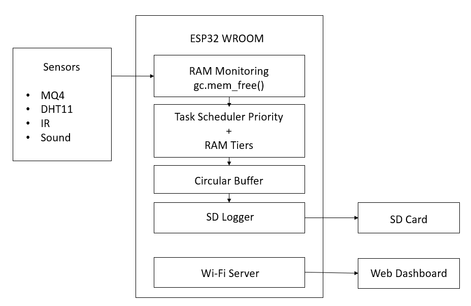
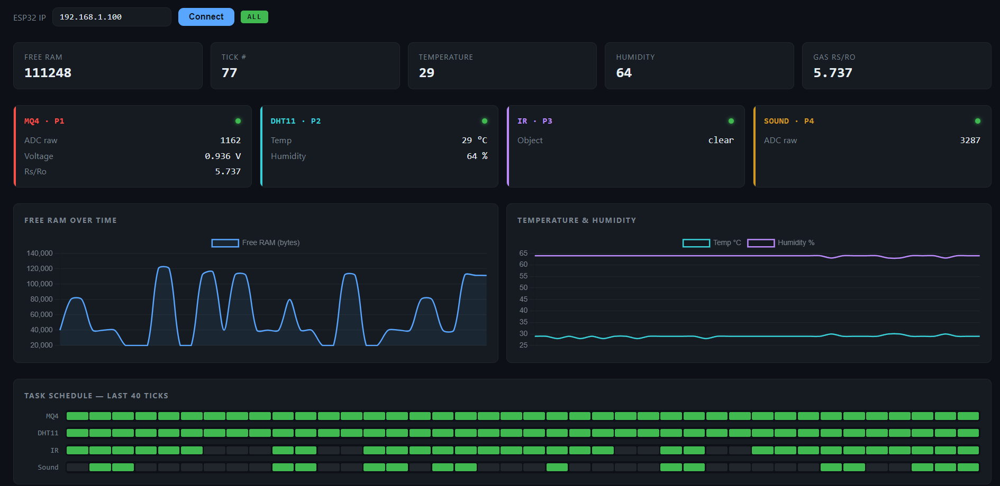

# ESP32 RAM-Aware Task Scheduler

A MicroPython-based task scheduling system for the ESP32 that dynamically manages sensor tasks according to available RAM.

The system dynamically monitors available RAM and adjusts sensor task execution based on memory availability. Higher-priority tasks are preserved when memory becomes limited, while lower-priority tasks are skipped to maintain system stability. Sensor readings are buffered in RAM and periodically stored on an SD card, with a Wi-Fi interface providing live system status.

## Features

- **RAM-aware scheduling** — Monitors available ESP32 heap memory at runtime.
- **Priority-based execution** — Assigns different priorities to sensor tasks based on importance.
- **Dynamic task skipping** — Suspends lower-priority tasks when available memory decreases.
- **Circular buffering** — Temporarily stores sensor readings before SD-card writes.
- **SD-card logging** — Stores sensor readings and scheduler decisions in CSV files.
- **Wi-Fi monitoring** — Provides HTTP endpoints for live system and sensor data.
- **Fault-tolerant operation** — Handles sensor, SD-card, and network errors without unnecessarily stopping the scheduler.

## System Architecture

The system is built around an ESP32 WROOM that monitors sensor tasks based on available RAM and task priority.

  

The system follows a modular architecture where the ESP32 collects sensor data, 
the RAM-aware scheduler prioritizes tasks based on available memory, and a 
shared buffer temporarily stores readings before they are written to the SD card.

The ESP32 can also host a lightweight web server that provides live sensor and 
scheduler information through a browser dashboard.

## Task Priority

| Priority | Task |
|----------|------|
| P1 | MQ4 Gas Monitoring |
| P2 | DHT11 Temperature & Humidity |
| P3 | IR Detection |
| P4 | Sound Monitoring |

Higher-priority tasks are retained when memory becomes limited, while lower-priority tasks are skipped first.

## Memory Management

The scheduler monitors available heap memory using `gc.mem_free()` and dynamically adjusts task execution.

| Free RAM | Tasks Executed |
|----------|----------------|
| ≥ 40 KB | P1–P4 |
| ≥ 28 KB | P1–P3 |
| ≥ 16 KB | P1–P2 |
| < 16 KB | P1 only |

A pre-allocated circular buffer is used to reduce unnecessary memory allocation.

## Hardware Requirements

- ESP32-WROOM
- MQ-4 Gas Sensor
- DHT11 Sensor
- IR Sensor
- Sound Sensor
- MicroSD Card Module & Card

## Software & Tools

- MicroPython
- Thonny IDE
- Visual Studio Code
- Git & GitHub
- HTML, CSS & JavaScript

## Project Structure

```text
ESP32-RAM-Aware-Task-Scheduler/
├── src/
│   ├── main.py
│   ├── scheduler.py
│   ├── sensors.py
│   ├── buffer.py
│   ├── sd_logger.py
│   ├── sdcard.py
│   └── web_server.py
├── dashboard/
│   └── dashboard.html
├── docs/
│   ├── system_architecture.png
│   └── dashboard.png
├── README.md
├── LICENSE
└── .gitignore
```

## Setup & Usage

1. Install MicroPython on the ESP32-WROOM.
2. Connect the required sensors and SD card module.
3. Copy the project files to the ESP32.
4. Configure Wi-Fi credentials in `src/web_server.py`.
5. Run `src/main.py`.
6. Monitor sensor readings and scheduler activity through the serial output or web dashboard.

## Web Dashboard

The ESP32 hosts a lightweight web dashboard for real-time system monitoring.



The dashboard displays:

- Available RAM
- Current memory tier
- Running and skipped tasks
- Live sensor readings
- Scheduler status

## Data Logging

Sensor readings and scheduler information are stored on the MicroSD card as CSV files.

- `sensor_log.csv` — sensor readings
- `scheduler_log.csv` — memory status and task execution information

## Future Improvements

- Dynamic task loading from the SD card
- Improved memory usage analysis
- More sensors and task types
- Enhanced web dashboard
- Remote configuration and monitoring

## Author

**Bhavana Biju**  
**Arya Anil**  

## License

This project is licensed under the MIT License.